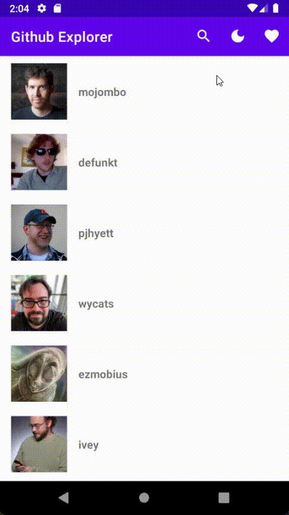

# GitHub Explorer

With the task given, I learned about

- Activity
- Room Database
- DataStore
- Dependency Injection
- Networking (Retrofit)
- MVVM
- Flow Coroutine
- View binding

## Screenshot

## License

Licensed under [MIT License](LICENSE)
